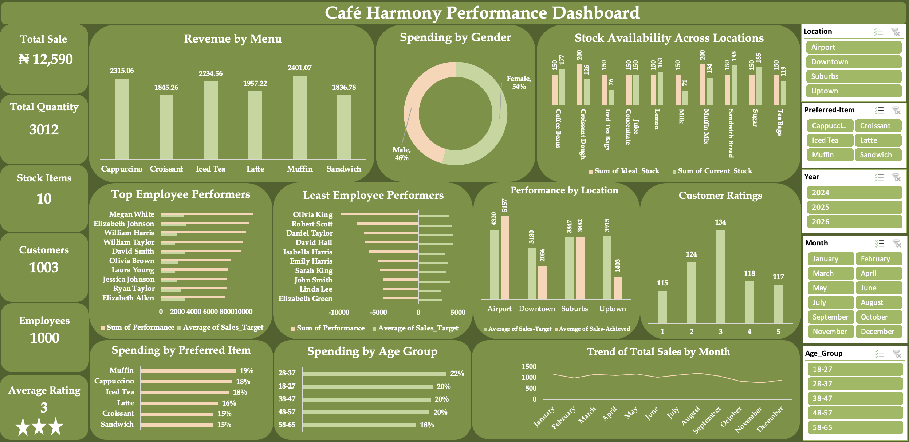

# Café Harmony Business Analysis

## 📌 Overview
This project analyzes Café Harmony’s business performance using sales and operational data to uncover trends, product performance, and business insights.

---

## 🎯 Objective
To generate actionable business insights from Café Harmony’s data and support decision-making related to sales performance, operations, and customer-facing strategy.


---

## 📊 Key Analysis Areas
- Sales Trends
- Product Performance
- Customer Demographics
- Stock & Inventory Insights
- Employee Performance
- Customer Ratings

---

## 🛠️ Tools Used
- Excel 
- Python
- Pandas
- Matplotlib
- Jupyter Notebook

---

## 📈 Key Insights
- Monthly sales aggregation provided a clearer trend view than daily-level plotting
- Some products contributed more significantly to total sales
- Business patterns identified through the analysis can support operational improvement

---

## Business Impact

This project shows how raw business data can be transformed into practical insights that support performance monitoring and strategic planning.

---

## 📸 Project Preview



---

## 📁 Project Structure 
```text
cafe-harmony-business-analysis/
├── data/
├── notebooks/
├── screenshots/
├── docs/
└── README.md


## Author

Hamzat Afe Isede